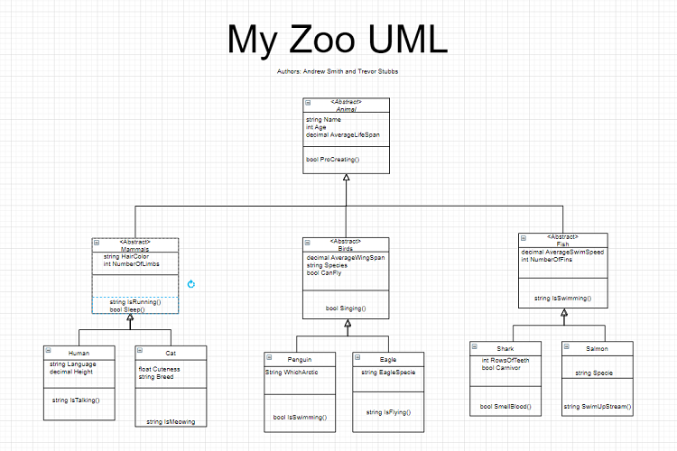
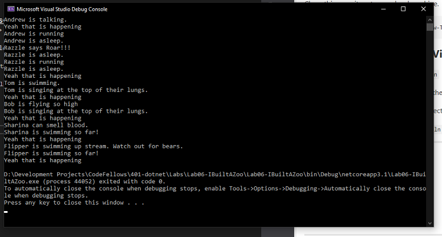

# Lab06: I Built A Zoo

## About us

Lab06: Lab06: I Built A Zoo

- *Author: Trevor Stubbs*
- *Author: Andrew Smith*

----

## Description
This is a C# console application console where users are able to build a zoo. All animals inherit their properties from 1 or more base classes.

---

### OOP Definitions

**Inheritance** - The ability for class for classes to *inherit* properties and methods from the classes they *derive* from.

**Abstraction** - The concept of hiding or showing unnecessary class members to the client user.

**Polymorphism** - The ability for a *derived* class to modify it's *inherited* properties and methods.

**Encapsulation** - The *grouping* together of data and assigning different *permissions*.

### OOP Implementations

**Inheritance** - The uppermost base class is the Animal class from which the classes Birds, Mammals and Fish directly derive
from. The Human and Cat classes both derive from the Mammals class. The Penguin and Eagle classes derive from the Birds class, 
and the Shark and Salmon classes derive from the Fish class. See the UML diagram for clarity.

**Abstraction** - The Human, Cat, Shark, Salmon, Eagle and Penguin classes are concrete classes. All of the concrete 
classes are being derived from abstract classes.

**Polymorphism** - *Coming soon lab07*

**Encapsulation** - *Coming soon lab07*

### Getting Started
Clone this repository to your local machine.

```
$ git clone [https://github.com/Andrew-Trevor/Lab06IBuiltAZoo.git]
```

### To run the program from Visual Studio:
Select ```File``` -> ```Open``` -> ```Project/Solution```

Next navigate to the location you cloned the Repository.

Double click on the ```Lab06-IBuiltAZoo``` directory.

Then select and open ```Lab06-IBuiltAZoo.sln```

---

### Visuals

#### UML Diagram

- 
- [Drawing](https://drive.google.com/file/d/1j4i0vq-xdRfi_IEjsjONRrAoG6vdJh-u/view?usp=sharing)

#### Using the Application


---

### Change Log
- 1.5: Added links to README
- 1.4: Comments and README
- 1.3: Functionally Finished
- 1.2: Classes Built
- 1.1: Initial Repo Setup


------------------------------
For more information on Markdown: https://www.markdownguide.org/cheat-sheet